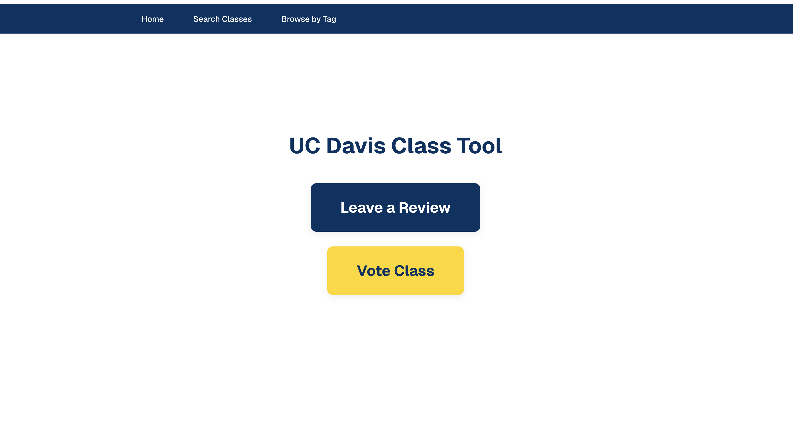
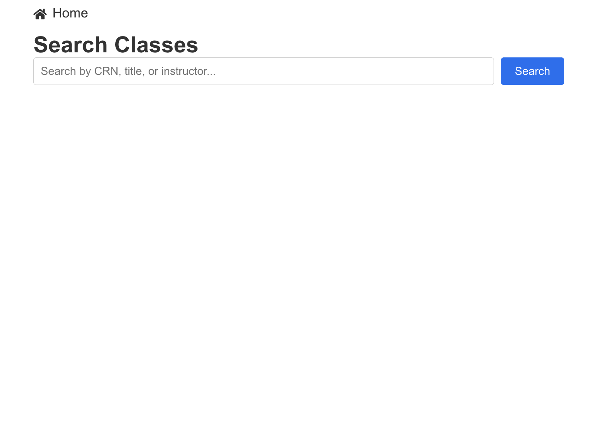
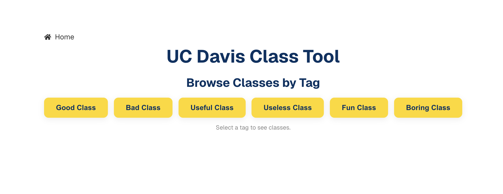
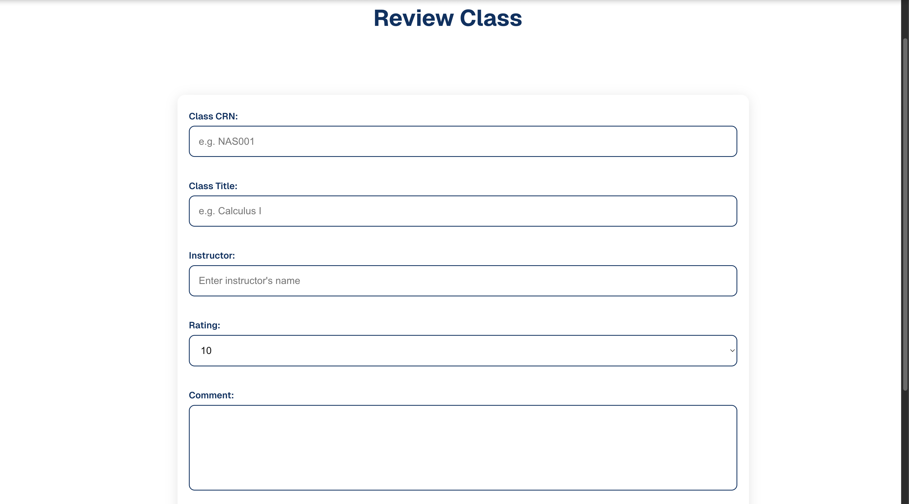

# UC Davis Class Tool 🎓

A modern web application for UC Davis students to discover, review, and rate classes. Built with Next.js 15, React 19, and TypeScript.

## 🖼️ Demo

### Homepage


### Search Interface


### Tag Browsing


### Review Form


## ✨ Key Features

- **Smart Search**: Search by CRN, title, or instructor
- **Tag-Based Browsing**: Browse by categories (Good/Bad, Useful/Useless, Fun/Boring)
- **Review System**: Rate classes 1-10 with detailed comments
- **Voting System**: Vote on class characteristics
- **Security**: Cloudflare Turnstile bot protection
- **Responsive Design**: Mobile-first approach

## 🛠️ Tech Stack

**Frontend:** Next.js 15, React 19, TypeScript, CSS Modules  
**Backend:** Prisma ORM, PostgreSQL, Next.js API Routes  
**Security:** Cloudflare Turnstile, Input Validation, XSS Protection  
**Deployment:** Vercel, Railway, AWS

## 🚀 Quick Start

```bash
# Clone and install
git clone https://github.com/yourusername/ucdclass.com.git
cd ucdclass.com
npm install

# Set up environment
cp .env.example .env.local
# Add your DATABASE_URL and TURNSTILE keys

# Set up database
npx prisma migrate dev
npx prisma generate

# Start development server
npm run dev
```

Open [http://localhost:3000](http://localhost:3000) to view the application.

## 🔧 API Endpoints

| Endpoint | Method | Description |
|----------|--------|-------------|
| `/api/reviews` | GET/POST | Fetch all reviews / Create new review |
| `/api/reviews/search` | GET | Search reviews |
| `/api/vote` | POST | Submit vote |
| `/api/vote/all` | GET | Get all votes |
| `/api/classes/search` | GET | Search classes |

## 🏗️ Architecture

- **Frontend**: Next.js App Router with TypeScript
- **Database**: PostgreSQL with Prisma ORM
- **Security**: Cloudflare Turnstile, input validation
- **Deployment**: Vercel with automatic CI/CD

## 🎯 Key Highlights

- **Full-Stack Development**: End-to-end application with modern tech stack
- **Security First**: Multiple protection layers against common vulnerabilities
- **Performance Optimized**: Fast loading with Next.js optimizations
- **User Experience**: Mobile-first responsive design
- **Production Ready**: Proper error handling, validation, and deployment

## 📄 License

MIT License - see [LICENSE](LICENSE) for details.

---

⭐ **Star this repository if you found it helpful!**
